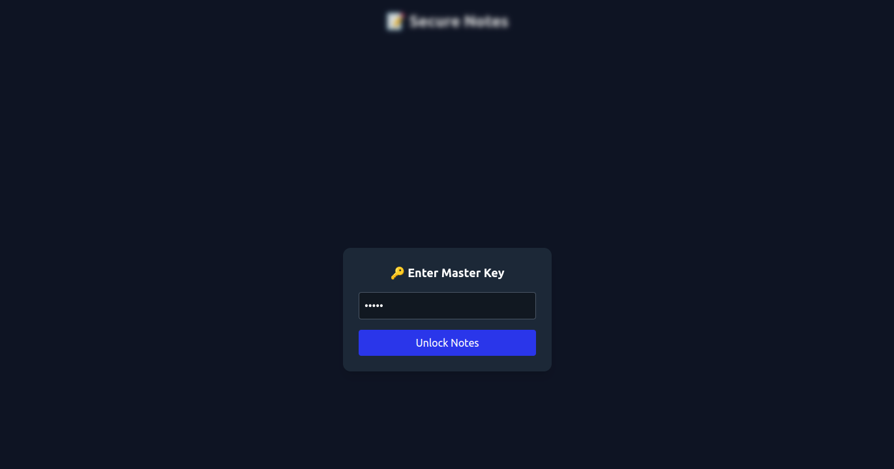

# Security Tools Collection

This repository contains a collection of small, security-focused projects built with **React** and **JavaScript**.  
The projects demonstrate my interest in cybersecurity and my ability to implement secure design practices in modern applications.

---

## Projects

### 1. Password Strength Checker

A tool to evaluate password strength in real time.

- Live input field with dynamic strength meter.
- Rules enforced:
  - Minimum length of 8 characters
  - At least one uppercase letter
  - At least one number
  - At least one special character
- Visual indicator of strength (Weak → Moderate → Strong).

_Screenshot:_  
![Password Checker Demo] (./assets/strong_pwd.png) (./assets/moderate_pwd.png) (./assets/weak_pwd.png)

---

### 2. Secure Notes Application

A secure note-taking application with client-side encryption.

- Notes are encrypted using AES before being stored in localStorage.
- A master key is required to unlock and decrypt notes.
- Functionality includes adding, viewing, and deleting secure notes.
- Demonstrates secure handling of sensitive data.

_Screenshot:_  


---

## Upcoming Additions

Planned projects to expand this repository:

- Phishing Website Detector – Identify suspicious URLs using rule-based checks.
- Bug Tracker Dashboard – A platform for managing vulnerabilities and bug reports.
- Custom Vulnerability Scanner (Work in Progress) – CLI and web-based tool for scanning open ports, weak passwords, and insecure configurations.

---

## Tech Stack

- React – Frontend framework
- Tailwind CSS – Styling
- CryptoJS – AES encryption library

---

## Getting Started

Clone the repository and install dependencies:

```bash
git clone https://github.com/mahaL1974/security-tools-basics.git
cd security-tools-collection
npm install
npm start
```
